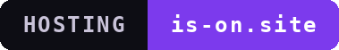
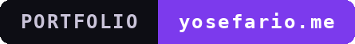
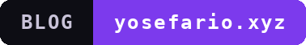

<div align="center">


# `yosefario`

security · cryptography · reverse engineering · full-stack

<sub><i>comfortable at both ends of the stack</i></sub>

</div>

---

## `whoami`

```text
yosefario
──────────────────────────────────────────────
work      full-stack, security, reverse engineering
focus     cryptography, purple teaming, security across the stack
also      self-hosting, developer tooling, automation
studio    TechVoid Co.
──────────────────────────────────────────────
```

## What I'm working on

A fair amount of it stays private, so the public side here is thin. Roughly:

- Reverse engineering, from apps down to the lower layers
- Cryptography and privacy-focused systems
- Self-hosted infrastructure and small developer tools
- Automating the parts of the job nobody wants to do by hand

## Projects

- **[TechVoid Co.](https://techvoid.co)** // studio where most of the newer work lives
- **[is-on.site](https://is-on.site)** // free static hosting, open to anyone

## Reach

```
github@yosefario.me
```

---

<div align="center">

<a href="https://is-on.site"></a>
<a href="https://yosefario.me"></a>
<a href="https://yosefario.xyz"></a>
<a href="https://techvoid.co"></a>

</div>